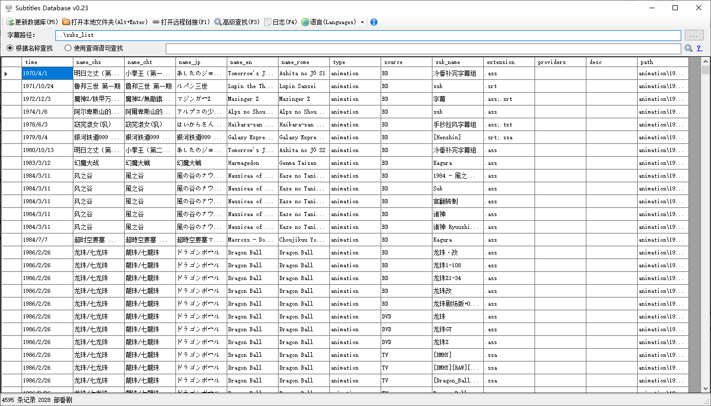
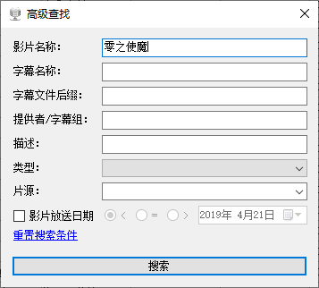
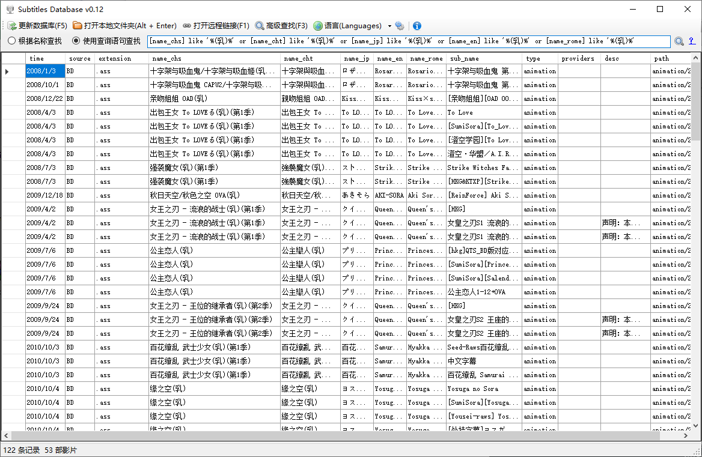

欢迎来到【字幕共享计划】

此计划是为了改进目前字幕的共享和下载方式，让共享字幕、搜索字幕、下载字幕变得更简便，制作了「Subtitles DataBase」工具。

「Subtitles DataBase」有几处需要说明的地方：
<ul><li>更新数据库：根据本地数据生成数据库（主要给字幕上传者使用）</li><li>高级查找：使用各种条件搜索
</li><li>查询语句：使用类似 SQL 的语法进行查询
&nbsp;&nbsp;&nbsp;&nbsp;&nbsp;&nbsp;比如 [time] &gt;= '2010.1.1' and [time] &lt;= '2011.1.1' and [extension] like '%srt%'
&nbsp;&nbsp;&nbsp;&nbsp;&nbsp;&nbsp;如果不熟悉 SQL 的用户，可以使用「高级查找」界面，效果差不多
</li></ul>

如果你是收藏党，打算下载所有字幕到本地计算机，可以：
    你可以检出我们的整个git仓库（包含「Subtitles DataBase」工具及源代码、仓库中的所有字幕文件）

如果你只是追番党，不打算下载所有字幕文件到本地计算机，可以：
只下载「Subtitles DataBase」工具（不到1M），选定需要的记录后，点击顶部菜单的「打开远程链接」就会在网站上显示你需要的结果

【格式】
提交字幕一般的格式如下（也可以直接参考git仓库中已提交的字幕）：

影片说明文件（可忽略，但不建议忽略）
sub_list/&lt;type&gt;/&lt;year&gt;/(&lt;date&gt;)&lt;name&gt;/info.txt
例如：subs_list/animation/2015/(2015.7.4)夏洛特 Charlotte

字幕文件
sub_list/&lt;type&gt;/&lt;year&gt;/(&lt;date&gt;)&lt;name&gt;/&lt;source&gt;/&lt;sub_name&gt;/&lt;字幕文件&gt;
例如：subs_list/animation/2015/(2015.7.4)夏洛特 Charlotte/TV/[诸神字幕组][Charlotte 夏洛特][简繁日双语字幕][01-13][TVrip][1080P]/[kamigami] Charlotte - 01 [1920×1080 x264 AAC Sub(Chs,Cht,Jap)].Chs-Jap.ass

字幕补充说明（可忽略，用途添加字幕提供者/字幕组、字幕说明等）
sub_list/&lt;type&gt;/&lt;year&gt;/(&lt;date&gt;)&lt;name&gt;/&lt;source&gt;/&lt;sub_name&gt;.txt
例如：subs_list/animation/2015/(2015.7.4)夏洛特 Charlotte/TV/[诸神字幕组][Charlotte 夏洛特][简繁日双语字幕][01-13][TVrip][1080P].txt

<table style="width: 100%;"><tr><td style="background-color: #dddddd;">&lt;type&gt;</td><td style="background-color: #dddddd;">分类（例如：animation、movie 等，可自定添加。animation 表示动画。那么问题来了，里番的英文是什么呢？也欢迎大家提交里番字幕）</td></tr><tr><td>&lt;year&gt;</td><td>影片放送的年份</td></tr><tr><td style="background-color: #dddddd;">&lt;date&gt;</td><td style="background-color: #dddddd;">影片放送的日期（如果不知道具体哪天，可以写成：(1998)或(1998.5)这样，忽略月、日）</td></tr><tr><td>&lt;name&gt;</td><td>影片名字</td></tr><tr><td style="background-color: #dddddd;">&lt;source&gt;</td><td style="background-color: #dddddd;">匹配的源（例如：BD TV Web test 等，可自行添加，但为了方便查找应该尽量统一。BD 表示 BDrip，test 表示未校对）</td></tr><tr><td>&lt;sub_name&gt;</td><td>一整套字幕的名称</td></tr><tr><td style="background-color: #dddddd;">&lt;字幕文件&gt;</td><td style="background-color: #dddddd;">例如 01.ass</td></tr></table>

最简单的例子可以参考：
subs_list/animation/2003/(2003.10.4)暗与帽子与书之旅人

有个复杂的例子（包括 info.txt、各种字幕说明），可以参考：
subs_list/animation/2015/(2015.7.4)夏洛特 Charlotte

为了多语言兼容性，提交的所有文本格式的文件，请尽量使用 UTF8 编码

注意：由于字幕太多，可能部分字幕缺少出处或必要的补充说明，可以联系本人修改or补充、或者直接取得提交权限自行修改。

需要提交权限的同学可以联系我，欢迎各种字幕组和手抄大佬加入。

Q群：1003173547